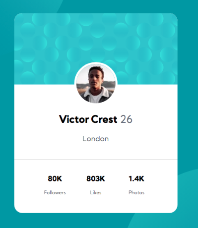

# Frontend Mentor - Profile card component solution

This is a solution to the [Profile card component challenge on Frontend Mentor](https://www.frontendmentor.io/challenges/profile-card-component-cfArpWshJ). Frontend Mentor challenges help you improve your coding skills by building realistic projects. 

### The challenge

- Build out the project to the designs provided

### Screenshot

### Links

- Live Site URL: 

## My process

### Built with

- HTML5
- CSS3, Flexbox

### What I learned

Just basic CSS recap
