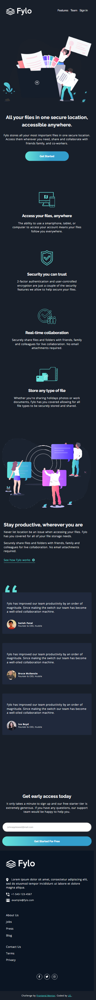

# Frontend Mentor - Fylo dark theme landing page solution

This is a solution to the [Fylo dark theme landing page challenge on Frontend Mentor](https://www.frontendmentor.io/challenges/fylo-dark-theme-landing-page-5ca5f2d21e82137ec91a50fd). Frontend Mentor challenges help you improve your coding skills by building realistic projects.

## Table of contents

- [Live Site URL](#links)
- [The challenge](#the-challenge)
- [Screenshot](#screenshot)
- [Built with](#built-with)

### Live Site URL

- https://fylo-landing-page2021.netlify.app/

### The challenge

Users should be able to:

- View the optimal layout for the site depending on their device's screen size
- See hover states for all interactive elements on the page

### Screenshot

### Built with

- HTML5
- CSS
- BOOTSRAP
- SASS

### Continued development

Need using more of SASS. I've just learned a few basics during this project
